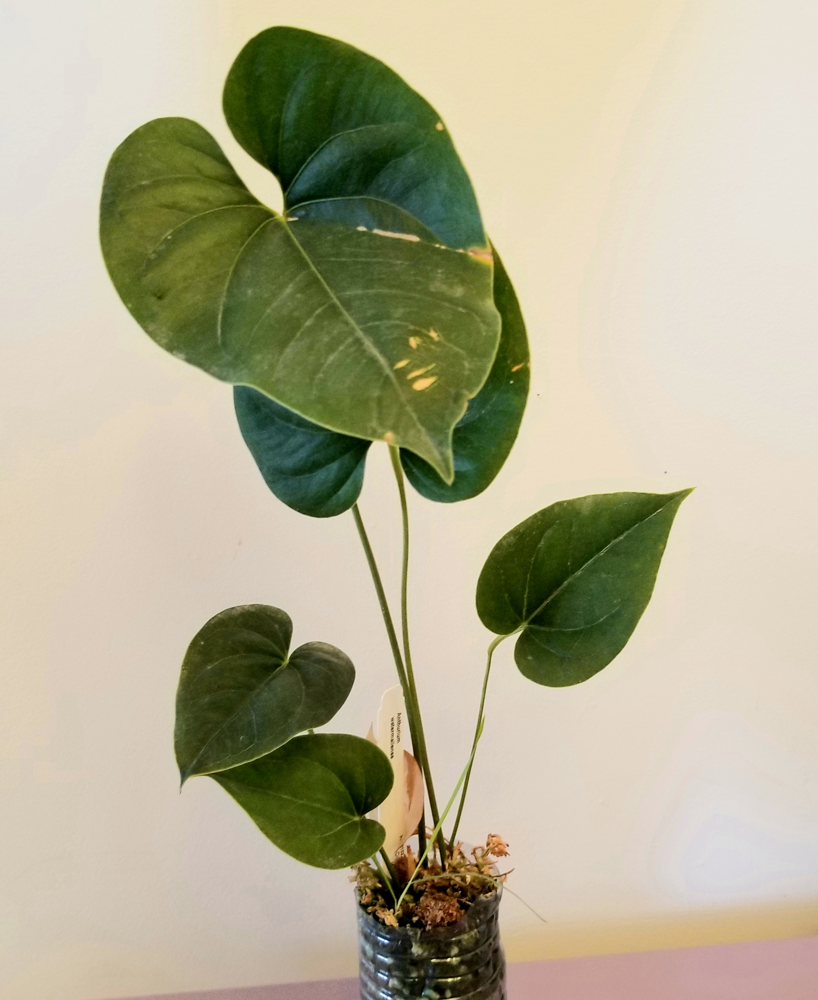

I imported 3 anthurium and 1 philodendron on April 18th which is 1 month and 11 days ago. So its been almost 6 weeks. 
Let's discuss how they did, from poorer ones to more successful ones..

### Philodendron Roseocataphyllum
This one will be short and sweet; me and my family were having allergic reactions to this plant. As I only spent ~$20 
on this plant we made the decision to throw it out. Yes I could've arranged a giveaway with any local plant friend, 
however I was too eager to be rid of this plant. I could barely bare to be in the same room with this plant, and 
that speaks a lot given that I do acclimate these in my bedroom.

### Anthurium Waroqueanum
As predicted, the queen anthurium is my least successful acclimation so far. This plant originally came in with 3 
leaves, 1 has yellowed and fell off but another is already starting to go as well. There's also a bunch of spots 
and crispy tips on this anthurium, which normally wouldn't worry me if the plant was growing well but it isn't.

Removing it from the moss mix that it was rehabbing in, almost all of its roots have died off. Dead roots fall apart
with the lightest touch, only revealing a thin hair. From my understanding, the thin hair is actual part of the 
root and the outside is what's protecting it. But as the root is now dead the root's protective layer will fall
apart as well. From that description, all of these roots are dead. Perhaps you can see in the picture that there is 
a little white healthy root nub, but that is the only one for this entire giant plant, and I knocked off the tip
while repotting it.

I removed the dead roots and cleaned up the chunk a little bit. It was actually quite pleasent, removing the dead 
tissue on the stem revealed a pleasent, cut grass scent. I also took a chonk cutting, I've never done this before 
on any anthurium, but this anthurium has a huge stem. Now normally I would wait till the plant has successfully 
rehabed before taking a cutting, but I'm not sure that will happen with this plant so this is more of an insurance
cutting. 

I cleaned up the chunk of stem and placed it in a pot of moss with a little cloche. It does have a little bit of 
rooting hormone to hopefully convince it to root. I hope this goes well!

### Anthurium Watermaliense seedling
I was actually inspired to check up on these plants because I saw the chunkiest roots off from the inside of this 
pot. While the leaves seem to be very flimsy, the root system itself has completely bounced back. One leaf has 
yellowed off of this plant, however I'm not very worried as it was the oldest leaf, and the yellowing is likely just a 
result of the stress.

As can be seen in the photos, there are lots of healthy white root tips that have developed in my care!
I potted it back in its little container, and in my normal aroid potting mix witha little bit of added sphagnum moss 
to ease its moss to soil transition.

### Anthurium Luxurians 
As expected, the luxurians has likely been the most successful import so far. There wasn't a single leaf that 
yellowed, and even the leaf that was emerging as the plant was shipped isn't heavily damaged, just a couple small
holes here and there. I am really amazed at how well this plant did especially for how exotic it looks.

Again, similarly with the Watermaliense, this plant was potted in a standard aroid mix with a little bit of 
sphagnum moss.

### Conclusion
and thats a 6 week update on the plants that were imported at the beginning of the spring! I really hope that 
they all make it.

