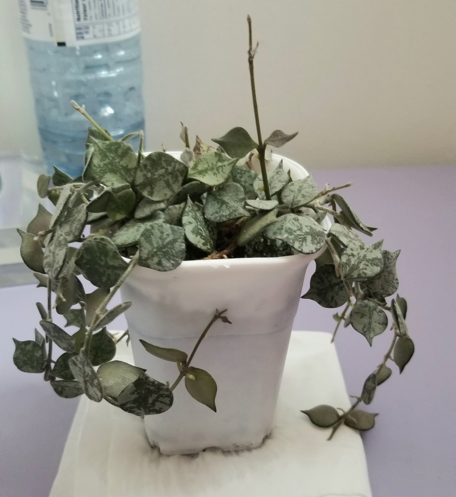
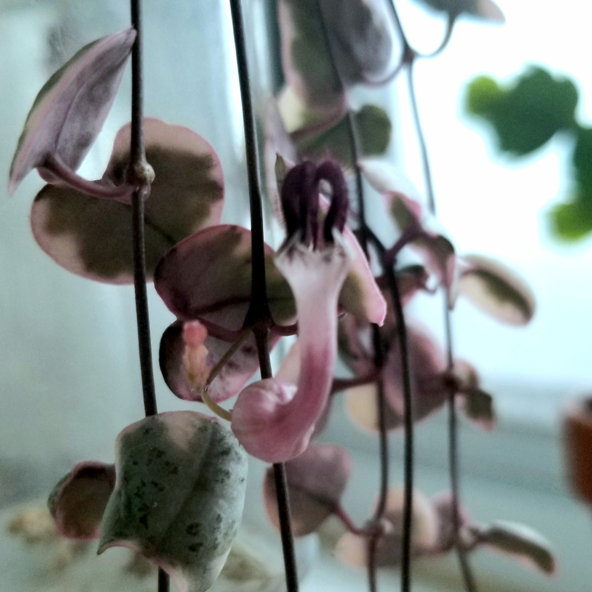
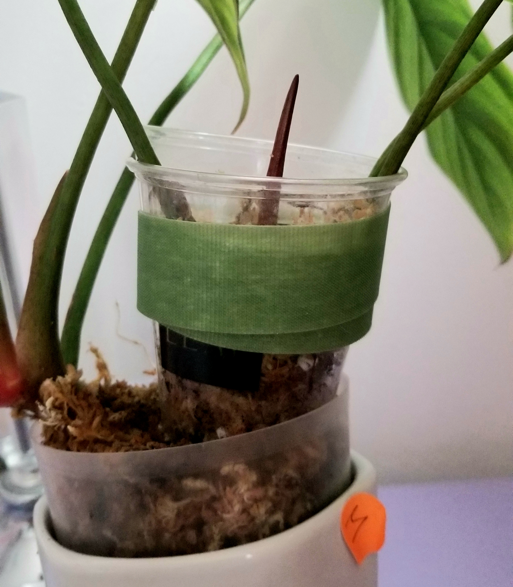

### Spring is Here! 
And obviously the most exciting thing of each new spring is propogating! Propogating 
can be done year round, but the success and speed are much higher in spring. So obviously 
I've left most of the fun things I've left till now. 

Here are some propogations I've taken the past few days with hopefully some for trading
for some of the plants on my wishlist this year. Some successes and obviously failures 
will be updated in the future! 

### Propogation boxes! 
Propogation boxes are smaller containers with high humidity, some light and preferably 
some warmth as well. This is usually used to directly grow new plantlets in a growing 
medium. I have had success rooting hoyas in propogation boxes, however as I don't have an area 
where I supplement humidity so  taking plants out of propogation boxes usually doesn't 
go well. However, I'll set some up in spring, as the ambient humidity in summer is usually
around 60 to 80% which is usually okay for these propogations. 

This hoya curtisii was one of the few hoyas I originally rooted in a propogation box. I 
received likely 10-12 nodes from a friend which, one year later, grew into this 
established little plant! I cut off all the little bits hanging over the side of the pot 
to plant in my prop box. The plant took about a 50% haircut, but I will be planting 
some of it back in the pot so it can be fuller than ever! 

Next up for a haircut is my hoya polyneura, who is unfortunately quiet the thirsty 
hoya and does get underwatered a tiny bit, the newer growth could definitely be more 
plump and firm. However the new growth has good form that I hope will make good new 
plantlets 

My last hoya that I want to propogate is this lovely sigillatus that I have. However 
I don't want to cut too much of this, as there are three vines actively pushing out lots 
of growth, so I could only put one node in the prop box. But it'll be a good experiment 
on whether sigillatus do well in prop boxes as I've never tried it before.

### Water propogation 
Water propogation is probably one of my favourite ways of propogating and maybe the one 
most rewarding to newbies as you can see the roots developing. I try to not let the water 
roots get too long though, because water roots are different from roots grown in other 
substances. So I try not to let the roots go more than a couple inches before potting it 
something a little bit more permanent. 

I've heard some people have success with rooting hoyas in water so I will give that 
a shot and see how it goes. Especially since I want to try growing some of these in 
semi-hydro during the year, and some water roots seems to help with growing in pon. 
So I have also stuck some polyenura, sigillatus and curtsii in the water. 

The next plant that I want to plant solely in water is my string of hearts. I did try 
the butterfly method with string of hearts some time but I did not have much success 
with it. My string of hearts has grown past the light source and is now getting 
leggy and reverting so I will chop it back so the new growth will still get plenty 
of light. 

### Airlayering
Lastly, I do intend on cutting up some of my big stately aroids this year, however 
I am very very very anxious about it. Airlayering is a good way to encourage 
a node to grow plenty of roots before I chop it. I will be airlayering my philodendron 
SP Silver (I'm working on a care guide!) using this little cut and some leftover 
mossy/perlite mix. 

I didn't fill the little cup fully with moss, as growth points are delicate and 
I am scared of rotting it. I will fill up the cup as I go along (and hopefully comes out 
with a new leaf aswell!)) Shouldn't take too long, this plant has been growing 
exceedingly well for me even though I got it during the winter!

Thank you for reading this whole ramble I appreciate it so much! And I will be making 
some updates (hopefully) on how the propogations fare, especially the hoyas as I'm very 
excited to see how the propogation box vs the water propgations perform.