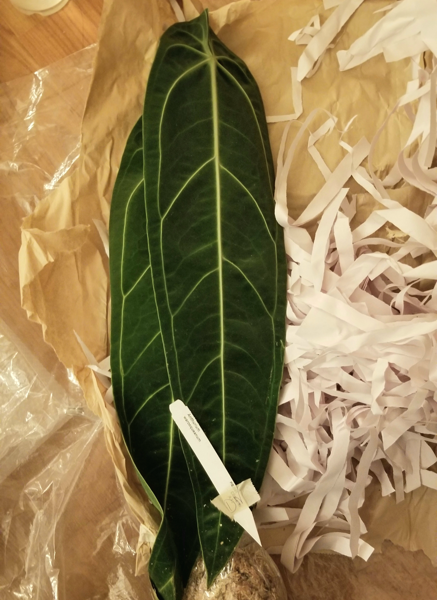

Some aroids are sold locally for hundreds of dollars. They're stunningly beautiful, but at 
this point in my life I cannot afford that kind of prices. Something that is a fun plant
project, that also gives me a shot at those beautiful hundred dollar aroids is importing.
Of course, importing isn't without risk - all these imports are at high risk of failing
and no doubt they'll have ugly leaves for a bit but I caught a good deal on equagenera's 
60th anniversary sale awhile back so I'm going to give it a shot!

I am planning on doing a few updates on the plants, at maybe 1 month and 6 month intervals. 
It's probably best to be fully transparent with how the plants fared using the methods 
I talk about.

### Quick Disclaimer!
I worked on all these plants during the evening, so the photos I took are not well lit. I 
did lightly edit most of them so that they would show up a bit better.

Alot of the import methods were inspired by unplantparenthood and Kaylee Ellen on youtube!

### Timeline
These imports were picked up that evening Friday the 18th. That evening I removed all of 
the protective moss and gave the stems a quick dip into 50/50 tap water, and 3% 
hydrogen peroxide. The peroxide dip is to kill off any bacteria that would later encourage
rot. Normally at this stage I would also remove obvious signs of rot - however I lucked out
as all the roots and stems didn't seem to have any problem at all. These plants went into
a bucket of water for 24 hours to rehydrate.

Then, saturday evening I washed off the plant using pure castile soap to get rid of 
any pests that may be lurking around on the leaves and petioles. I've been using the soap below, and 
while I haven't seen any pests yet, its smell is also kind of annoying. I will be searching 
for a scentless version once I'm finished with my current bottle. I also removed any roots 
that I didn't think were going to be successful, then potted up the plants in a mix of 
sphagnum moss and perlite and horticultural charcoal. In theory I should've used an even 
amount of moss and perlite, however I'm running low on good quality perlite so I was a bit 
stingy. They were placed in warm rooms with a little bit of soft light. 

[soap](https://ravenvision-orchid-supplies.myshopify.com/collections/supplements-and-additives/products/pure-castile-soap?variant=31885094617190 "soap from ravenvision")

I'm going to organize the details of each plant separately, to make it a bit more cohesive 
to read. Feel free to read about whatever plant you're interested in!

### Anthurium luxurians

Thank you so so much to the beloved friend that purchased this plant for me, I am so excited 
to have this beauty in my collection. This plant is absolutely stunning and every time I think 
about this plant, it takes my breath away. This is equagenera's medium size. Excuse the 
wrong label that I accidentally used.

The luxurians came in amazing condition. I've heard that these are studier than some other 
velvet leaf anthuriums. Supposedly shiny anthurium as opposed to velvet tend to be more 
tolerant to lower humidity and less traditionally desirable conditions. This anthurium 
also has super chunky, clarinervium like roots. Reminds me of udon noodles! 

Despite the long trip there was almost no sign of root rot or dried roots, just a few that 
snapped in shipping that I plucked off. It doesn't have a particularly long chunk of stem, 
but as spring is coming I'm sure it'll grow quickly. This anthurium is on the top of many 
people's anthurium wishlist as its obviously gorgeous! 

It is currently potted in mix primarily of sphagnum moss, but also perlite and horticultural
charcoal in a clear 4.5 inch slotted orchid pot.

### Anthurium Waroqueanum

Anthurium Waroqueanum is well known as the queen anthurium, and with its tempermental 
reputation I was absolutely terrified of importing this. The only reason I did, was 
equagenera had a really good deal for these, $40USD + fees, whereas online I frequently see 
these sold for hundreds of dollars. The queen anthurium is absolutely stunning so I went
for it. And she did not disappoint. The plant came in with 3 leaves, 1 slightly yellowing 
and each of the leaves are well over a foot long. 

I am also very content with the wrapping, there was shredded paper protecting all of 
the leaves. The roots were, as expected, not in the best shape. Roots are dead if you tug 
on them and they completely come off, leaving only thin strands. It didn't appear as 
though they died of rot, so I can only assume that those roots died of dehydration. This 
anthurium does have a much finer root system than sturdier anthurium, so its not surprising 
that it is less drought, or low humidity tolerant than the others. She will not enjoy 
dry canadian winters. 

Above is a picture of the anthurium roots before I went in and pulled off most of the 
dead roots. I tried to get as many as possible, but I feel like there were so many and 
there are probably still some dead roots tucked away somewhere. Unfortunately, I was not 
able to take a good picture of the root system after being cleaned off (I was wearing 
masks, face covering and gloves) but here is the remaining root system in all its 
blurry-iness. 

However, the stem is extremely long, so worst case scenario I will be able 
to propogate tons of little baby queen anthuriums, that I probably will never be able 
to take out of the prop box buT THATS FINE! 

### Anthurium Watermaliense Seedling
I haven't seen many pictures of big stately anthurium watermaliense, but I wanted 
to tack something a little out of the ordinary onto my order, with some subtle 
veination and this little anthurium seemed to fit! I haven't fully decided if I love 
this plant or not - this will be dependent on whether or not I can grow it to be a large 
speciman. One things I've been really loving about anthurium is huge dramatic lobes 
which is exactly what I'm seeing when I google this plant. I also see dark flowers which 
I would absolutely _adore_. 

The first thing I noticed about this little anthurium's roots is that theyre so small 
and compact compared to its foliage. I would not have thought that this large of a plant
(I know it's labeled seedling but length wise it's taller than the waroq) could only 
come with that little roots but you learn something new everyday. These roots are also 
quite firm and chunky, like the luxurians however I did remove the bits that snapped in
transit. It was kinda sad, given how small this system already is, but those roots 
would not make it and I do not want them turning to mush and encouraging rot.

This little guy's root system is so tiny that I could pot him up in the cut up bottom 
of a used water bottle! Again, potted in moss with some perlite and charcoal, but since 
there are no drainage hole I added some leca to act as a drainage layer. And a big 
rock because this plant was so top heavy. 

### Philodendron roseocataphyllum

And now comes to the one and only non anthurium that I imported. I've wanted a large, 
climbing philodendron for awhile now that I could put on a lazy moss pole and grow 
out huge mature leaves. However, this might not be the one for me as when I was working 
on this plant I got an allergy attack. I think it has to do with the philodendron sap, 
as it is an irritant to the skin (not specifically this philo, but the genus itself). 
The sap obviously evolved as a deterrent to this plant's predators, and perhaps it was 
extra volatile due to import stress but if I cannot get the allergy in check I will be 
getting rid of this plant. Nevertheless this plant is absolutely lovely and I hope I 
do get to keep it.

[Example1](https://www.poison.org/articles/dieffenbachia-and-philodendron-202 "Article by Poison Control")
[Example2](https://www.gardenersworld.com/how-to/grow-plants/plants-with-irritant-sap/ "Article by gardenersworld")

Philodendron roots are a lot more fine than anthurium roots, this plant actually reminds 
me of my philodendron pastazanum that I imported july of last year (that later died 
because of a mistake I made - but knock on wood I might still have reincarnated its stump)
so I will be using the same rehabbing method.

The super fine secondary roots on philodendron roseocataphyllum will be removed - or 
as much I can as there are so many roots - and it will be rehabbied in a mossy mix. These 
roots are super fine and hairline, they will likely not do too well with drought. Lastly,
I did my best to remove old philodendron sheaths, however at this point the sap was really 
getting to me and I didn't do the best job of it. I just wanted to get as far away from 
the plant as possible, so I simply potted it in an old clear take out container.

### Group photo! 

Lastly, a gangly photo of all the anthuriums together! The philodendron got banished to 
the storage room (it has a window though) as we didn't want to come in contact with it
lest it trigger allergy attacks again. Thank you for reading through this way too long 
post and I hope everyone's imports do well!

