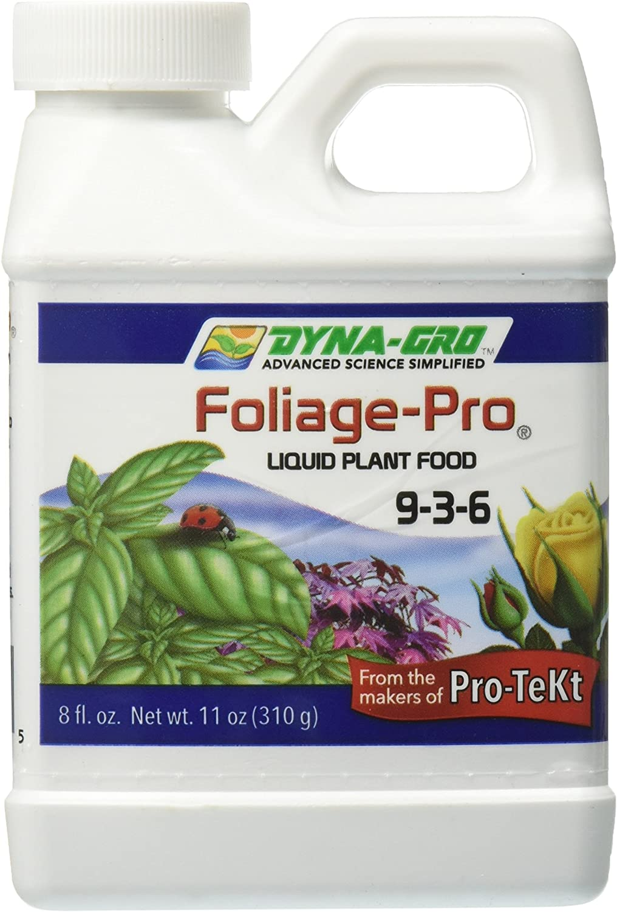
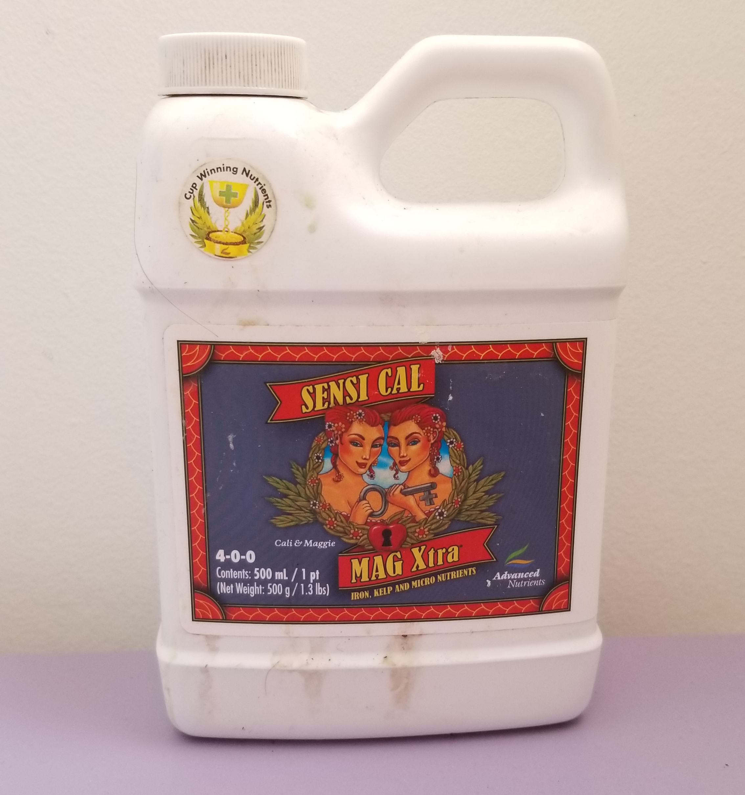
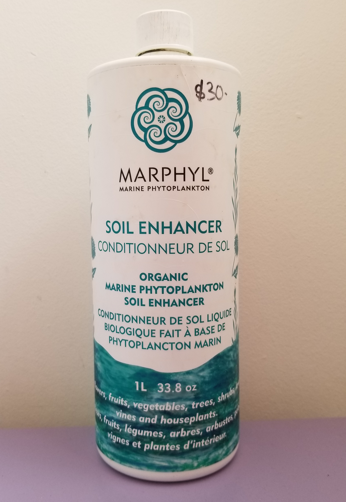
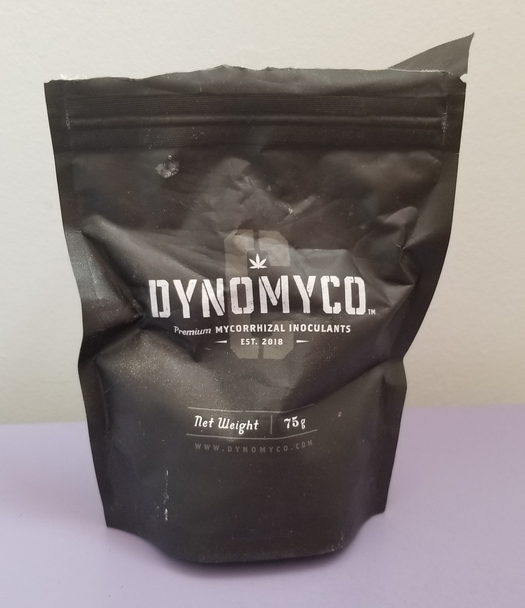
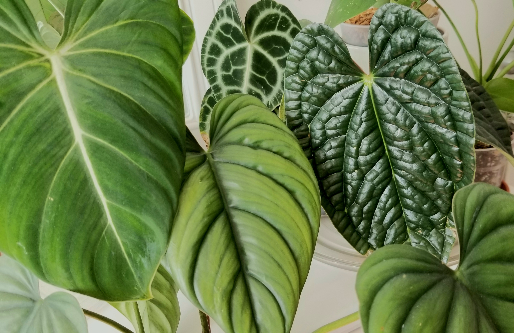

Some plants can survive long periods of time without fertilizer and even grow to decent sizes (I'm looking 
at you, snake plants) but it is my opinion that all plants need some kind of fertilizer eventually. Of course, 
plants use chemical compounds to put out new growth structures, so it only makes sense that they need to 
have these same chemical compounds returned to them.

### General fertilizer
The macro nutrients, Nitrogen Phosphorus and Potassium, form the basis of many fertilizers. Nitrogen, is used 
for the production of foliage and is a key element used to develop chlorophyll cells. Without nitrogen, plant 
structures such as leaves would not be able to photosynthesize and create glucose. Phosphorus is a necessary
chemical for root development and absorption. Lastly, potassiums helps increase the ability of plant stems and 
leaves to uptake nutrients and disperse them within the plant itself. These three are considered macro nutrients
as a plant uses the greatest concentration of these three elements, and they are important to plant growth. 

I am currently using the general fertilizer, Dyna Grow foliage which is formulated in a 3:1:2 ratio to promote 
foliage growth. I have been using this for about half a year, so I don't really have any opinion on whether this 
is the best general fertilizer. I suppose any fertilizer with a similar ratio of nitrogen phosphorus and potassium 
would bear similar results.

I purchased the 8oz bottle from amazon. At the time of writing, I do see a huge debate on amazon reviews, as the 
8oz bottle is $29 (again, at time of writing) and the 32 oz bottle is $43. Obviously, the 32 oz bottle is a lot 
more worth the price as it is 4x the quantity with maybe a 50% price increase. However, I'm not too upset over 
this since I don't use a whole lot of the fertilizer anyways - I doubt I'll finish this 8oz bottle this year. That,
and I'm eager to finish this bottle so I can try something new.

### Calcium supplement 

Based on everything I've read, it is to my understanding that plants desperately require calcium, and unfortunately 
since they don't need a ton of calcium, calcium gets overlooked in most fertilizers. Calcium in plants is whats known 
as an immobile nutrient, once calcium is used it cannot be regained. Other nutrients such as nitrogen, can be 
moved around in a plant's structure. This is why nitrogen deficiencies are commonly seen in the lower leaves - the 
plant is using those nutrients to power new growth. Since calcium is immobile, calcium deficiencies are most 
commonly seen in newer plant structures. 

Calcium (and magnesium) are important elements of a plant's immune system and can help prevent fungal issues, diseases,
and reduces pest damage and root rot. If you find your plants are rotting way too often, perhaps some cal mag will 
do the trick. I use this product that I found on amazon. It seems from the reviews that this product also has some 
highs and low in terms of pricing. Currently it says about $17 for the 500ml product for me, however using the honey 
chrome extension I can see that this product was $25 in March. 

[cal-mag from amazon](https://www.amazon.ca/Advanced-Nutrients-Sensi-Cal-Mag-Nutrient/dp/B00P8EVEEY/ref=sr_1_6?keywords=cal+mag+for+plants&qid=1650407063&sprefix=cal+mag%2Caps%2C106&sr=8-6)

From personal experience, the use of cal-mag has seemed to make my plants a lot more stronger and resilient, especially
against low humidity which is something I struggle with. I have seen a lot of good results since I started using this 
product and it is definitely something I recommend getting. I first learnt about cal-mag from this blogger herebutnot !
I actually don't experience a lot of root rot even though I am an underwaterer, and my philodendrons (when well fed 
with cal-mag) do not seem to experience the normal unfurling issues that you would expect in a low humidity home.

[article by herebutnot on how orchids need calcium](https://herebutnot.com/getting-leaves-crown-phalaenopsis-wet-isnt-end-world/)

### Soil enhancer 

Now, to be honest I'm not fully sure what a soil enhancer is, however I saw this product frequently recommended,
even in combination with the products above and I say I quite enjoy it. I enjoy using organic products, as I feel 
that several organic fertilizers will cover a good amount of micronutrients as well. As previously discussed, just 
because a plant uses larges quantities of the NPK elements, doesn't mean other micronutrients aren't also important. 

I use the marphyll soil enhancer (I'm not fully sure if it has 1 or 2 l's) with my plants. I purchased this locally, 
though it is also available on amazon (in various sizes, and cheaper than what I paid locally it seems!). This 
product is very dilute, it goes quickly so get more than you think you might need. I've used this 1L bottle for 
about 50-60 houseplants (good mix of tropicals and succulents) for a year and I'm almost halfway through.

My aroids especially seem to enjoy this product, however, I did buy this around the same time that I bought the 
dynamax fertilizer, so I can't really attribute the new quantity and quality of growth to either of the products. 
In addition, from the guarantee'd analysis section on marphyll's website, it seems that marphyll contains large 
amounts of nitrogen, calcium and magnesium, as well as trace amounts of potassium boron and iron. Four out of 
the six chemicals are already present in a combination of dynamax pro + calmag, so it may seem that this fertilizer 
is an unnecessary addition. I may test this out further, however there is also the argument that as this is an 
organic product, it contains many trace chemicals that may be used by plants as micronutrients. 

### Other fertilizer related products.

In addition to the chemical fertilizers above, I also use three other products in my fertilizer regime. 

Mycorrhizae is a fungi, that in the wild have a symbiotic relationship with plant roots. Mycorrhizae helps 
roots uptake nutrients and seemed to increase the rate at which my big leaf aroids size up. I originally was 
inspired to use myco by watching videos by unplantparenthood and youdontevengrowhere on youtube, however 
myco hasn't seemed to increase the growth of my plants as explosively. Perhaps this is because for my plants, 
nutrient uptake was never an issue, light availability, humidity and warmth has always been their 
limiting factor, not nutrients. So while I do enjoy the product, I wouldn't say I'm crazy about it.

Secondly, I do use earthworm castings as a soil admendment. Again, I really do enjoy organic fertilizers so 
I would recommend earthworm castings. Earthworm castings is, well, worm poop, but since worms are a decomposer,
this is a product that can be readily absorbed by plant roots. The only thing I am wary of, is that when 
reading about soil mixes, it seems that nobody really has a mix of more than 5-10 % worm castings. Would worm
castings (when used in large porportion) damage the roots of indoor plants? Secondly, worm castings are 
uptaken by plant roots at a relatively slow rate, so for heavy feeders such as anthurium and alocasia, worm 
castings don't always seem to be enough. So while I would heavily recommend worm castings to friends (indeed 
when I gift plants to friends, I always add lots of worm castings) I don't think its a complete fertilizer 
on its own. 

Lastly, everyone's heard of that trick of using a foliar spray for hoyas and orchids. I do use a foliar spray 
sometimes that I get locally (the micracle grow orchid mist), but it goes by quickly. So while I like the 
product I don't always use it. I actually really like using this spray in my prop boxes which is usually what 
I reserve this spray for. I will be keeping my current bottle of orchid mist and trying to use it to mix 
my own foliar spray, that I may use a little more generously.

### My fertilizer routine.

Now I talked a lot about what fertilizers I use and why, but I didn't talk much about my fertilizer routine yet. 
It does change based on seasons and growth. I notice in my collection, my anthuriums and alocasias seem to be 
the biggest feeders, followed by philodendrons and hoyas, then prayer plants, orchids and succulents. 

I do fertilize year round as long as I see growth, and I try to feed a dilute amount everytime I water. I roughly
categorize my fertilizers as 'high, medium, and low'. For plants that aren't really growing I might use a little 
bit of marphyll or some orchid mist but thats it.

Prayer plants, orchids and succulents get a 'low' amount of fertilizer. So for a 500ml bottle, this is roughly 1ml 
of marphyll, 0.2-0.3ml of calmag, and a few drops of dynagrow. Prayer plants and orchids also seem 
to enjoy it when I use leftover aquarium water. My aquarium is planted, so the aquatic plants usually get to the 
fish/shrimp waste first, but I think they like that it's been dechlorinated. 

All my hoyas and remaining aroids get a 'medium' amount of fertilizer, unless I start to see signs of being 
underfertilized. Plants are underfertilized when their new leaves start to come out kind of pale, and streaky green. 
In more severe cases, lower leaves will start to die off (this is what we talked about with plants moving mobile 
nutrients to feed new growth). For plants that receive a 'medium' amount of fertilizer I usually provide 3ml of 
marphyll, 0.5ml of calmag and 0.15ml (I wing it to be honest) of dynagrow mixed with 500ml of water.

So when it comes to plants who've shown that they need more than a 'medium' amount of fertilizer, I will usually 
use (for 500ml) 3ml of marphyll, 1ml of calmag and 0.3-0.5 ml of dynagrow. My anthuriums and alocasias seem 
to really enjoy this mix, and its has resulted in lovely dark silky new leaves. 

### Things I want to try:

There are so many new things I want to try in this new hobby. First of all, I want to experiment with different 
general fertilizers, because while dynagrow has been working well for me so far, I always wonder if something 
can work better. I've heard good things about liquid gold leaf, however I'm unsure about how to acquire it in 
Canada. Secondly, I like the idea of liquidirt, however I don't always have easy access to distilled water for 
making the liquidirt mix, so its not very feasible for me at the time. 

I also want to try new slow release fertilizers, as I like the idea and they are convenient for the lazy 
gardener. I would like to try osmocote, and MSU fertilizer.

Lastly, I do want to use fertilizers for not only foliage development, but maybe flowers as well. This summer,
I plan on growing (for the first time!!!) outdoor balcony crops, not just houseplants. As crop plants are 
optimized for their flowers and fruit, they need a different NPK ratio. 